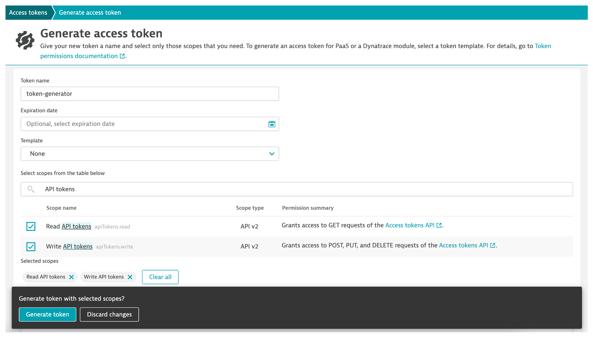

## Dynatrace Tenant Setup

You will need a Dynatrace SaaS tenant.

### Identify Dynatrace SaaS Tenant

Make a note of the Dynatrace environment name. This is the first part of the URL. `abc12345` would be the environment ID for `https://abc12345.apps.dynatrace.com`

* For those running in other environments (such as `sprint`), make a note of your environment: `dev`, `sprint` or `live`

### Skip DT OAuth Client (optional)

> ⚠️ Stop! If you are unable to create an OAuth Client, you can still complete this lab with partial functionality ⚠️

Use the following fake values for your OAuth Client:

Client id: 
```text
dt0f02.ABC123
```

Client secret:
```text
dt0f02.ABC123.J5TVHCR6MJ4AAO4PX3MFGUKX4E42QJ4MUAM65DGC7ZKOHBK7DKY23WQPBKO
```

Account URN:
```text
urn:dtaccount:e64e7279-f0b0-43e0-aedb-9eb3fa8c5cac
```

### Create DT OAuth Client

Open the Dynatrace Account Management page.  Click on `Identity & access management`.  Click on `OAuth clients`.


Create a new OAuth Client by clicking on `Create client`.

Provide your account email address and name the client `segments-client`.

Configure the client to have the following permissions:

> - `document:documents:write`
> - `document:documents:read`
> - `automation:workflows:read`
> - `automation:workflows:write`
> - `storage:logs:read`
> - `storage:events:read`
> - `storage:events:write`
> - `storage:metrics:read`
> - `storage:bizevents:read`
> - `storage:bizevents:write`
> - `storage:system:read`
> - `storage:buckets:read`
> - `storage:spans:read`
> - `storage:entities:read`
> - `storage:fieldsets:read`

Note: Your user account must have these permissions.  Follow [the documentation](https://www.dynatrace.com/support/help/platform-modules/business-analytics/ba-api-ingest) to set up an OAuth client + policy + bind to your service user account email.


After the client is created, copy and save the client details.  Once you click `Finish`, you can never obtain the `client secret` ever again!!

You should now have 5 pieces of information:

1. A DT environment (`dev`, `sprint` or `live`)
1. A DT environment ID
1. An OAuth client ID
1. An OAuth client secret
1. An account URN

### Create DT API Token

Create a Dynatrace access token with the following permissions. This token will be used by the setup script to automatically create all other required DT tokens.

1. `apiTokens.read`
1. `apiTokens.write`



You should now have 6 pieces of information:

1. A DT environment (`dev`, `sprint` or `live`)
1. A DT environment ID
1. An oAuth client ID
1. An oAuth client secret
1. An account URN
1. An API token